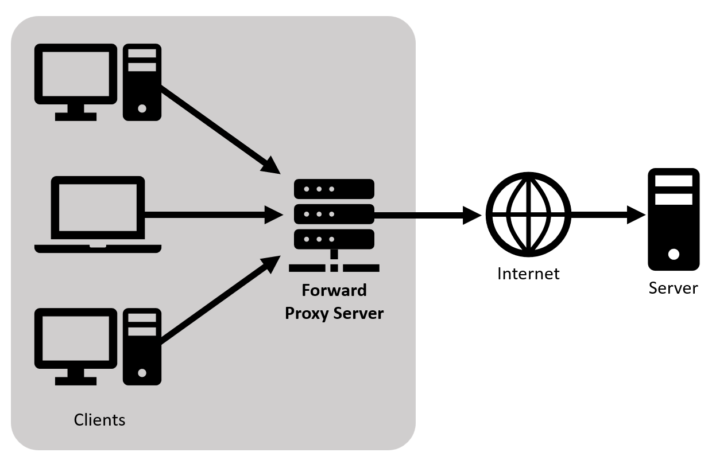
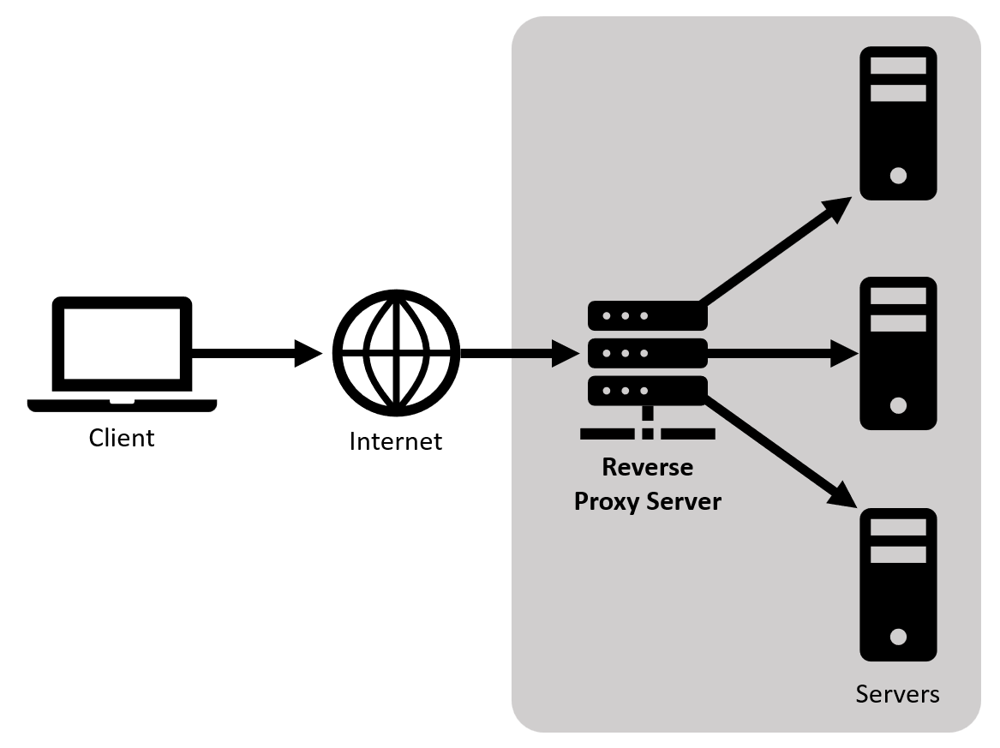
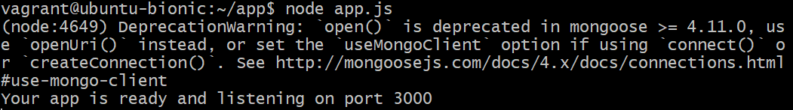
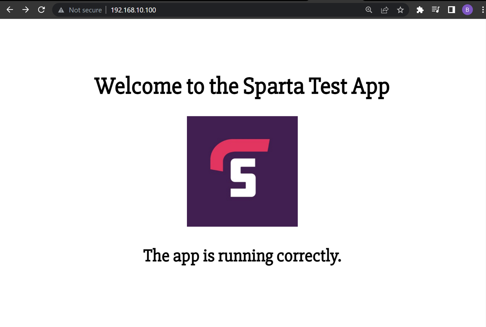
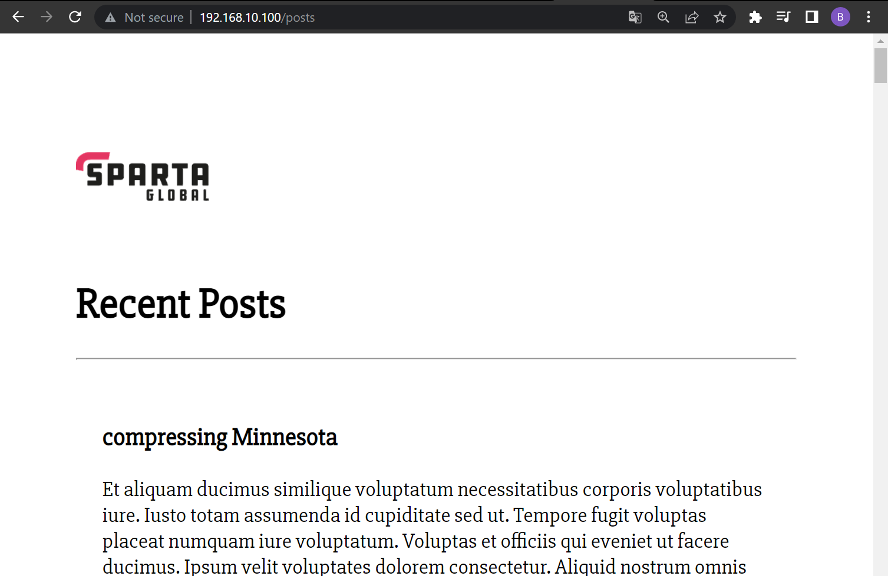

# Nginx Reverse Proxy

## Ports

Ports are virtual locations on a server where network connections start and end. They are software-based and managed by a computer's operating system. Each port is associated with a specific process or service and most are reserved for specific protocols; for example, messages sent over HTTP go to port 80. The purpose of using ports is to sort the network traffic servers receive. Some common protocol port numbers are shown below:

|  Protocol  | Port Number |
| :---: | :---: |
| SSH | 22 |
| Telnet | 23 |
| DNS | 53 |
| HTTP | 80 |
| HTTPS | 443 |
| NETCONF | 830 |

## Forward Proxy

A Forward Proxy is the most common form of a proxy server and it sits between the client and the internet. It is used to pass all traffic and requests from private network clients to the internet through a firewall and vice versa.

### Uses

- **Privacy** - Hides the identity of clients from web servers by masking the IP address, similar to a VPN.
- **Caching** - Improves connection speed by caching previous request data.
- **Logging** - Proxies can monitor and do what they want with the request.
- **Restrict content** - A forward proxy can block requests, e.g. websites a company does not want employees to visit.



*A Forward Proxy acts on **behalf of clients** where it forwards requests to the internet and web servers.*

## Reverse Proxy

A Reverse Proxy acts in the opposite way to a Forward Proxy as it sits between the internet and web server. It is used to pass traffic and client requests from the internet to one or more backend servers, adding en extra layer of protection.

### Uses

- **Protection** - Hides identity and protects server infrastructure, e.g. from DDoS attacks. Client does not interact directly with the web server.
- **Caching** - Improves backend performance via caching requests.
- **Load balancing** - A Reverse Proxy can be a Load Balancer and distribute traffic spread over multiple servers hosting the same content to optimise the reliability of the web app.
- **Handles SSL encryption** - SSL handshakes are computationally  expensive thus a Reverse Proxy can free up servers since they only need to handle SSL handshakes from the Proxy instead of all clients.



*A Reverse Proxy acts on **behalf of servers** where it intercepts requests from the internet and forwards to servers.*

## Nginx Reverse Proxy Setup

Previously, we set up and deployed our sample app on an Nginx web server and connected it to a MongoDB database server ([tech230-multimachine](https://github.com/bradley-woods/tech230-multimachine)).

Now we will set up the Nginx web server as a reverse proxy so instead of accessing the private IP address port 3000 to access the website, we can use the reverse proxy so users can access it from the internet using a domain name. In this case, we do not have a domain name so we will just use the private IP address (192.168.10.100) to access the webpage and database content.

1. Firstly, we need to locate and edit the default Nginx configuration file which can be found in the `sites-available` directory (`/etc/nginx/sites-available/default`) and is shown below. Open the file using the nano editor:

    ```console
    $ sudo nano /etc/nginx/sites-available/default
    ```

    ```bash
    ##
    # You should look at the following URL's in order to grasp a solid understanding
    # of Nginx configuration files in order to fully unleash the power of Nginx.
    # https://www.nginx.com/resources/wiki/start/
    # https://www.nginx.com/resources/wiki/start/topics/tutorials/config_pitfalls/
    # https://wiki.debian.org/Nginx/DirectoryStructure
    #
    # In most cases, administrators will remove this file from sites-enabled/ and
    # leave it as reference inside of sites-available where it will continue to be
    # updated by the nginx packaging team.
    #
    # This file will automatically load configuration files provided by other
    # applications, such as Drupal or Wordpress. These applications will be made
    # available underneath a path with that package name, such as /drupal8.
    #
    # Please see /usr/share/doc/nginx-doc/examples/ for more detailed examples.
    ##

    # Default server configuration
    #
    server {
            listen 80 default_server;
            listen [::]:80 default_server;

            # SSL configuration
            #
            # listen 443 ssl default_server;
            # listen [::]:443 ssl default_server;
            #
            # Note: You should disable gzip for SSL traffic.
            # See: https://bugs.debian.org/773332
            #
            # Read up on ssl_ciphers to ensure a secure configuration.
            # See: https://bugs.debian.org/765782
            #
            # Self signed certs generated by the ssl-cert package
            # Don't use them in a production server!
            #
            # include snippets/snakeoil.conf;

            root /var/www/html;

            # Add index.php to the list if you are using PHP
            index index.html index.htm index.nginx-debian.html;

            server_name _;

            location / {
                    # First attempt to serve request as file, then
                    # as directory, then fall back to displaying a 404.
                    try_files $uri $uri/ =404;
            }

            # pass PHP scripts to FastCGI server
            #
            #location ~ \.php$ {
            #       include snippets/fastcgi-php.conf;
            #
            #       # With php-fpm (or other unix sockets):
            #       fastcgi_pass unix:/var/run/php/php7.0-fpm.sock;
            #       # With php-cgi (or other tcp sockets):
            #       fastcgi_pass 127.0.0.1:9000;
            #}

            # deny access to .htaccess files, if Apache's document root
            # concurs with nginx's one
            #
            #location ~ /\.ht {
            #       deny all;
            #}
    }


    # Virtual Host configuration for example.com
    #
    # You can move that to a different file under sites-available/ and symlink that
    # to sites-enabled/ to enable it.
    #
    #server {
    #       listen 80;
    #       listen [::]:80;
    #
    #       server_name example.com;
    #
    #       root /var/www/example.com;
    #       index index.html;
    #
    #       location / {
    #               try_files $uri $uri/ =404;
    #       }
    #}
    ```

2. You can see the default server configuration in the `server` block, which listens on port 80 (HTTP) by default . Within this, replace the underscore in the variable `server_name` to your domain name or in this case our IP address we want to access in our browser:

    ```bash
    server_name 192.168.10.100;
    ```

3. Next, edit the `location /` block so the reverse proxy can pass requests from the above IP address to the correct port our app is listening on. It should look similar to the below:

    ```bash
            location / {
                proxy_pass http://localhost:3000;
                proxy_http_version 1.1;
                proxy_set_header Upgrade $http_upgrade;
                proxy_set_header Connection 'upgrade';
                proxy_set_header Host $host;
                proxy_cache_bypass $http_upgrade;
        }
    ```

    > **Note:** `/` represents accessing the root address: 192.168.10.100 as defined above.

4. Also, we want to give access to our posts page served by our MongoDB server. Therefore, we can create another location block as follows:

    ```bash
            location /posts {
                proxy_pass http://localhost:3000/posts;
                proxy_http_version 1.1;
                proxy_set_header Upgrade $http_upgrade;
                proxy_set_header Connection 'upgrade';
                proxy_set_header Host $host;
                proxy_cache_bypass $http_upgrade;
        }
    ```

    > **Note:** `/posts` represents accessing the following address: 192.168.10.100/posts.

5. Save and exit the nano editor and use the following command to check for any syntax errors:

    ```bash
    $ sudo nginx -t
    ```

6. Next, we need to restart Nginx using the command as follows:

    ```bash
    $ sudo systemctl restart nginx
    ```

7. Now, given the connection between VMs was established correctly (process outlined [here](https://github.com/bradley-woods/tech230-multimachine)) you should be able to navigate to your app folder using `cd app` and start your app using:

    ```bash
    app$ node app.js
    ```

    

8. Finally, navigate to your browser and type in the address we specified in our nginx configuration file (192.168.10.100) and we should see the sample app webpage. If we enter '/posts' after the address we should also see the 'Recent Posts' content served by our database server.

    

    

    > **Note:** in practice, an SSL certificate should be used to encrypt the requests to the website so it can be made available via HTTPS, then the private IP address can be replaced with a domain name (<https://example.com>).
